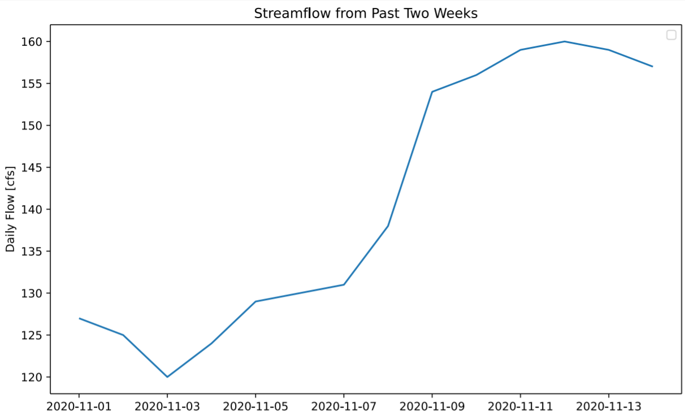
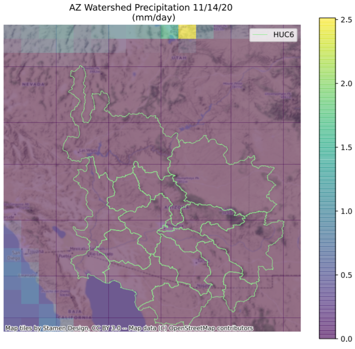

Alexa Marcovecchio

November 16, 2020

Assignment 12

1. A brief summary of the how you chose to generate your forecast this week.

  For my two week forecast, I plotted the streamflow over the past two weeks, and estimated the rate of streamflow increase visually.

  

  For my 16 week forecast, I found the 5 years with the lowest streamflow based on the annual average streamflow. Then, I averaged the streamflow from those five years for the days within each forecast period in order to get the weekly average streamflow.

2. A description of the dataset you added

  The dataset I selected was from MERRA-2 precipitation, I chose it because I wanted to look at maps of precipitation over the watershed area to see what regions were contributing most to streamflow.  The netCDF files contained daily average large scale rainfall, convective rainfall, and snowfall rates.  The spatial resolution is 0.5 degrees by 0.625 degrees.  I got the data from NASA GES DISC.  I extracted the data for each type of precipitation using xarray, summed up the different types of precipitation, and then multiplied that by a factor of 86400 to convert the units to mm/day.

3. A plot of the dataset you added. This can be a timeseries, map, histogram or any other plot that you think is a good summary of what you added.

  

4. Finally add your plot and a brief summary of what you did to our slide deck for this week here

  See slide 12.
