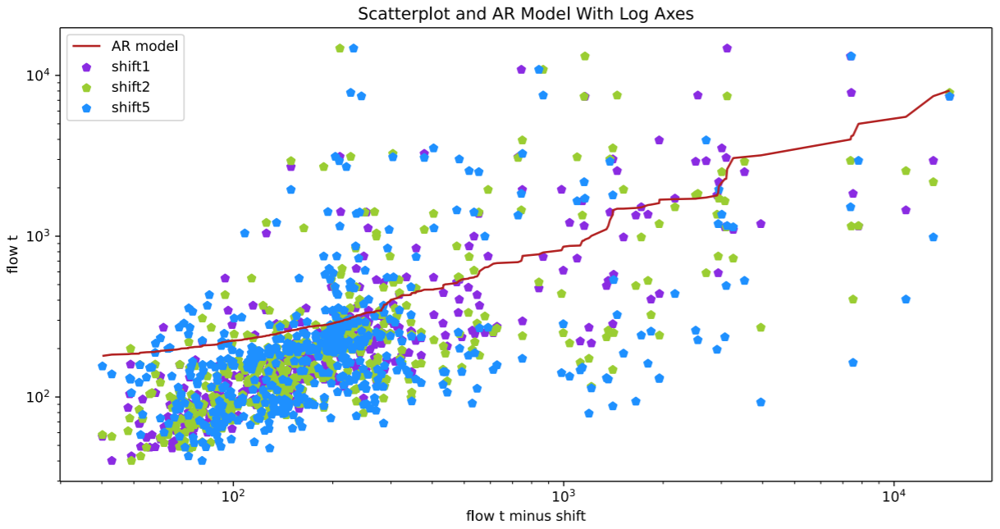
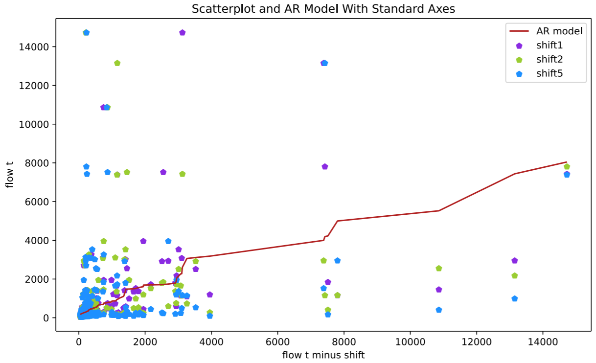
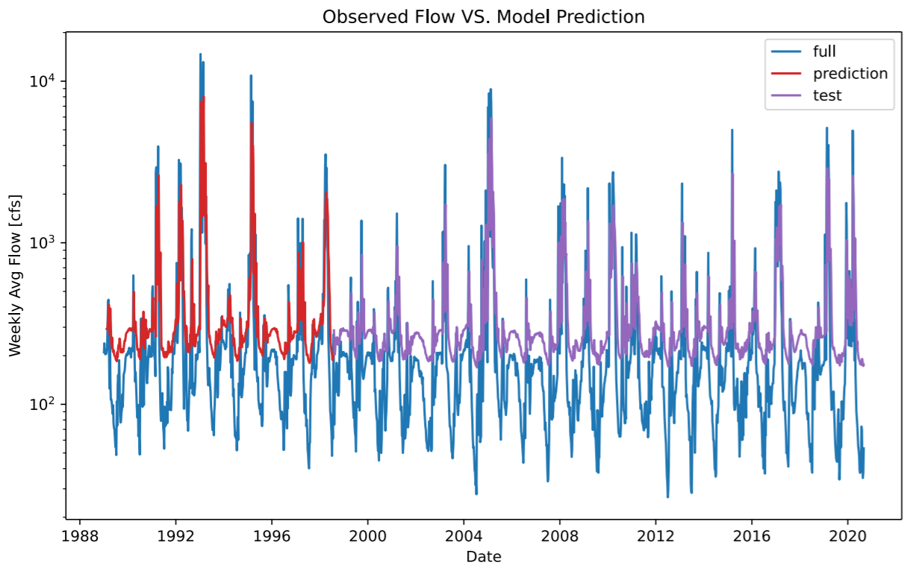

Alexa Marcovecchio
October 5th, 2020
Assignment 6

Forecast Summary: *see question 3*

For your written assignment provide the following. Your submission should include at least 3 different types of plots:

1. A summary of the AR model that you ended up building, including (1) what you are using as your prediction variables, (2) the final equation for your model and (3) what you used as your testing and training periods. In your discussion please include graphical outputs that support why you made the decisions you did with your model.

  My model is described in Marcovecchio_HW6_part1.py.  For my prediction variables, I have three shifts of the flow variable: 1 day, 2 day, and 5 day.  The final equation is y = 147.98 + 0.49(x1) + 0.03(x2) + 0.17(x5) with an r^2 value of 0.33.  I used the first 500 flow entries (skipping the first 5 to account for the 5 day maximum shift) as training and then used all data after day 500 as the test dataset.

  Based on my limited understanding of hydrology, I felt that adding an extra shift that is 5 days behind might better reflect the slower process of runoff joining streamflow.  Looking at the log scale vs standard scale plots also showed me how clustered the vast majority of streamflow values are.  I did not realize how dramatic the difference between most values and the outliers would be until I looked at the plot with a standard scale.

  

  

2. Provide an analysis of your final model performance. This should include at least one graph that shows the historical vs predicted streamflow and some discussion of qualitatively how you think your model is good or bad.

  Looking at my model predictions vs test group, it is clear that my model is very bad at predicting values that are below average.  It does seem to capture the spikes in data pretty well, though. I would not call it a good model, but it is much better than I thought it would be.

3. Finally, provide discussion on what you actually used for your forecast. Did you use your AR model, why or why not? If not how did you generate your forecast this week?

  Given the issues with my model, I elected not to use it in my streamflow prediction.  My code for forecasting is in Marcovecchio_HW6_part2.py. I essentially used the same method as homework 5, but I was able to use half the lines to do so.  I directly subsetted the entries for the dates within each forecasting week and took the mean of the data for each week.  I was able to accomplish this using one line per week.
