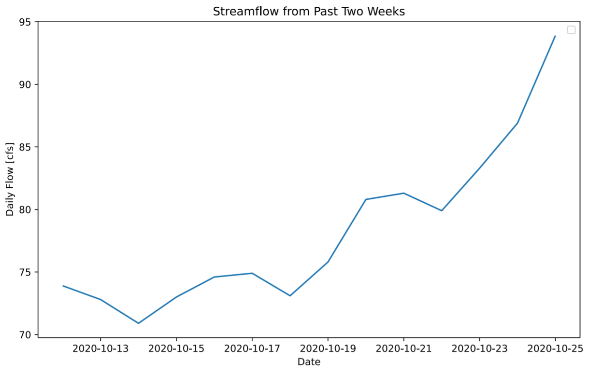

Alexa Marcovecchio

October 26, 2020

Assignment 9

___
#### Grade
3/3 - Nice work
___

1. A brief summary of how you chose to generate your forecast this week.

I chose to generate my two week forecast by looking at a plot of streamflow at Campe Verde and precipitation at nearby Sedona for the past two weeks.  There was no new precipitation but a consistent increase in streamflow of about 10 cfs/wk, so I used that to make the prediction of 100 and 110 cfs for my week 1 and week 2 predictions, respectively.  I then got my 16 week forecasts using the same method as last week by averaging all streamflow from the past 30 years on the dates within the forecast period.

2. A description of the dataset you added: What is the dataset? Why did you choose it? What location have you chosen? Where did you get the data from? What was your approach to accessing it?

I chose a precipitaiton dataset from the closest nearby station of Sedona, AZ.  The runoff from rainwater and its slow infiltration into the ground would eventually impact streamflow.  I got this data from mesonet and used its url API to load a json file with the data into a pandas dataframe.

3. A plot of your additional time series along with your streamflow time series.

