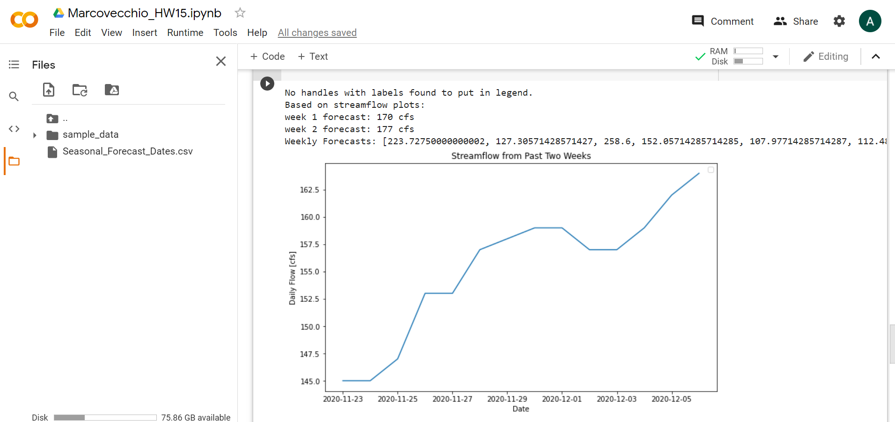

### Alexa Marcovecchio
### Assignment #15
### December 7, 2020

#### What resources did you request on Ocelote?

I requested 1 node, 1 cpu, and 6 GB with an expected 5 minute run time.

#### How long did you wait in the queue for your job to run and how long did it take to run?

Unfortunately, my job did not run and gave the error message: "qsub: Job rejected by all possible destinations".  I unfortunately did not start this part of the project early enough to email you to thoroughly debug after my application to ocelote was accepted, but I spent a good amount of time trying to get the job to work.  I followed all of the steps as they were written, so I'm really not sure what I did wrong.  My pbs file is in this folder if you want to take a look at it.

#### What was the most confusing part to you about setting up and running your job on Ocelote?

The most confusing part was uploading files, scp would let me enter my password and do a duo push, but would then reject my request to transfer files.  I ended up using OnDemand instead.

#### Where else did you run your job? How did the setup compare to your run on Ocelote?

I ran my job on Google Colab:

It was much easier to use than ocelote and required no changes to my code or really any setup.  I just uploaded my files and it worked.

#### What questions do you still have after doing this?

My main question is: what did I do wrong in setting up my ocelote job? I'm going to email you about this shortly.
