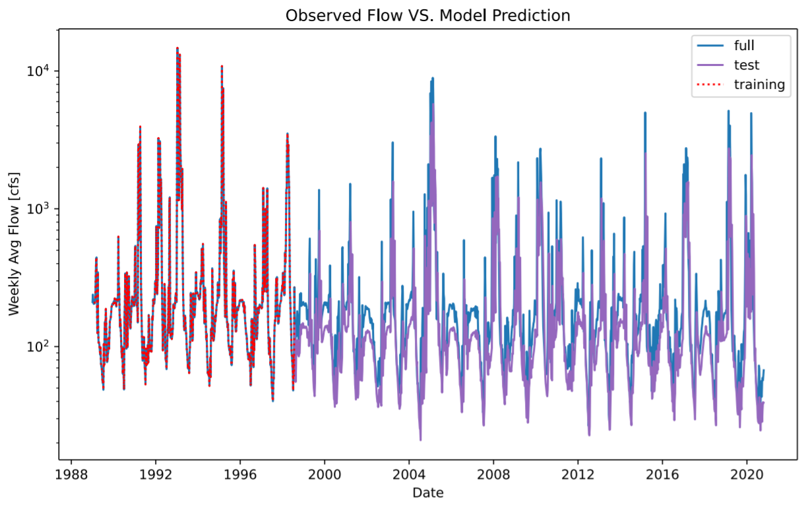

Alexa Marcovecchio

October 18th, 2020

Assignment 8

#### Grade 
 - 6/6  Great  job!
 - Readability: 3
 - Style: 3 
 - Code: 2

 - Really nice job with the comments especially on your funciton. 
 - I made a suggestion for how you could make your 16 week forecast in a loop

1. A brief summary of the AR model you built and why. Use whatever graphs you find helpful.

  The AR model I built has three shifts of the flow variable: 1 day, 2 day, and 5 day. I used the  first 500 flow entries (skipping the first 5 to account for the 5 day maximum shift) as training and then used all data after day 500 as the test dataset. I also calculate the regression without the y-intercept because this improves the accuracy of the function. A comparison between training data, test data, and observational data is shown in the figure below.

    

2. An explanation of how you generated your forecasts and why (i.e. did you use your AR model or not?)

  I elected to use my averaging method to generate my forecasts because I don't have enough confidence in my AR model yet. For the 1 and 2 week forecast, my AR model does not take into account that this is a very dry year.  Also, my AR model does not capture maximum and minimum values well, as shown by the graph.

3. A brief summary of what you got out of the peer evaluation. How did you make your script better?

  The peer evaluation showed me that I needed to add some more comments.  I also noticed that Alcely had defined her functions at the top of the script, which is a convention I follow in my normal coding, so I moved my function to the top of the Homework 8 script.  I also figured out how to best combine my 16 week forecast and model forecast by resetting the flow dataframe after completing the AR model calculations.

4. Describe the part of your script that you are most proud of and why.

  I am most proud of how nicely organized and commented my code is.  I like to stay organized and be descriptive wherever I can so I can always go back to my code later and still understand what I was doing.
